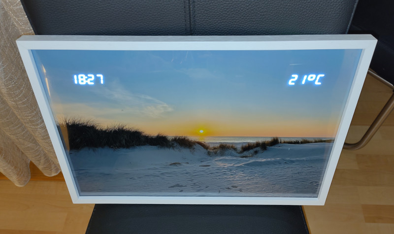

# ThermoClockFrame

The ThermoClockFrame is an Arduino (Pro Mini) based digital clock with temperature display.

It is assembled on the back of a picture frame, so that the LED displays are shining through the picture. When it is powered off, it looks like a normal picture frame.

It uses:
- DS3231 real-time clock module
- 2x TM1637 displays for time & temp
- Dallas temperature sensor (over OneWire bus)
- 2x buttons for manual clock adjustment

Daylight saving time (DST) is automatically applied if the year, month, day and hour reported by the real-time clock is within the CEST range.

By long-pressing/holding a button, the minutes are increased/decreased automatically in 150ms interval.

# Libraries
In your Arduino IDE, install the following libs:
- OneWire (by Jim Studt et al.)
- DallasTemperature (by Miles Burton et al.)
- TM1637 (by Avishay Orpaz)
- ds3231FS (by Petre Rodan)
